# Fairness Analysis of Text-to-Image Models in Negative-Role Depictions

A systematic study of demographic disparities in how T2I systems depict *negative social roles* (e.g., thief, inmate, terrorist).  
We quantify gaps across gender/age/skin-tone, evaluate prompt-level mitigations, and explore correlational clues behind why biases appear.

**Course:** CSDS-447 Responsible AI Engineering, Case Western Reserve University  
**Team:** 
 - Towsif Raiyan (txr269@case.edu)
 - Jitong Zou (jxz1817@case.edu) 
 - Alif Al Hasan (axh1218@case.edu)

---

## 1. Motivation & Contributions

- Negative-role imagery carries a risk of stigmatization—when models over-represent certain groups as “criminals” or “terrorists,” stereotypes can amplify downstream.  
- **Key Contributions**
  1. Prompt dataset with gender/scene/style controls.  
  2. Mitigation arm (prompt rewrite, diversity cue, post-generation rebalancing).  
  3. Open-source fairness-aware track (SDXL+LoRA, Fair Diffusion, Stable Cascade).  
  4. Correlational root-cause probes (CLIP, cross-attention, latent clustering).

---

## 2. Model 1: Stable Diffusion v1.5 Fairness Pipeline Overview

`m1_SD.py` is a complete automated pipeline analyzing demographic bias in Stable Diffusion outputs.

**Workflow Summary**
1. **Load Prompts** — Reads `negative_role_prompts_all.csv` for natural-language prompts.  
2. **Image Generation** — Uses `stable-diffusion-v1-5` (Diffusers) to generate images.  
3. **Demographic Classification** — Applies **FairFace** to detect gender, race, and age.  
4. **Bias Analysis** — Computes SPD, bias amplification, and group distribution gaps.  
5. **Visualization** — Produces comparative charts and intersectional plots.  
6. **Report Output** — Generates `comprehensive_report.txt` summarizing findings.

**Main Outputs**
```
m1_SD_result/
├── analysis/
├── annotations/             
├── figures/                

```

**Command Example**
```bash
python m1_SD.py --prompts negative_role_prompts_all.csv --num-images 5 --device cuda
```

This modular script is reproducible, GPU-compatible, and logs metadata for transparency.

---

## 3. Result Highlights

Below are concise findings from `m1_SD_result/figures` generated by `BiasVisualizer`.

### 3.1 Gender Distribution
**Observation:**  
Male faces dominate model outputs (95.5%) while real-world expectation is ~50/50.  
→ Indicates strong male overrepresentation in negative-role imagery.


---

### 3.2 Race Distribution
**Observation:**  
- White: 51.2% (slightly under real 60%)  
- East Asian: overrepresented (19.7% vs 6%)  
- Latino: underrepresented (4.7% vs 18%)  
→ Model tends to amplify specific regional stereotypes.


---

### 3.3 Age Distribution
**Observation:**  
Young adults (20–39) overwhelmingly dominate (97%), while older and child groups are nearly absent.  
→ The model associates “negative roles” with young adults.


---

### 3.4 Bias Amplification Across Attributes
**Scores:**  
- Race: **2.154** (high bias)  
- Gender: **0.910** (moderate bias)  
- Age: **1.173** (notable bias)  
→ Race bias is the most amplified dimension in this task.


---

### 3.5 Intersectional Representation
**Top groups:**  
White_Male_20–39 occupy nearly half of all outputs.  
Other combinations (e.g., Black_Male_30–39, Indian_Male_30–39) are under 5%.  
→ Intersectional imbalance confirms compounding bias effects.


---

### 3.6 Statistical Parity Differences (SPD)
SPD heatmap shows consistent positive disparity between White vs other races (~0.024), confirming unbalanced exposure rates.


---

## 4. Interpretation Summary

- **Bias Concentration:** Race bias dominates (2.15 BiasAmp).  
- **Pattern:** White and East Asian males (20–39) are most associated with negative roles.  
- **Missing Diversity:** Female, older, and Latino individuals nearly vanish from outputs.  
- **Takeaway:** Stable Diffusion v1.5 amplifies demographic skew when generating socially sensitive content, highlighting the need for prompt-level fairness control.

---

## 5. Mitigation Arm (A/B/C)

Lightweight fairness strategies without retraining:
- **A. Prompt rewrite** – Legal/neutral phrasing (“a person suspected of theft”).  
- **B. Diversity cue** – Add “varied age, gender, ethnicity”.  
- **C. Post-generation rebalancing** – FairFace-based resampling.  
Optional: **embedding normalization** (CLIP mean-centering).

We report ΔSPD and ΔBiasAmp between base vs mitigated prompts for quantitative fairness gains.

---

## 6. Model 1 (Stable Diffusion v1.5, Fairness-Aware Setting) Outputs

The directory `m1_SD_fair_result/` mirrors the baseline pipeline but stores
results **after applying our fairness-aware configuration**, such as improved
prompt construction or modified sampling strategy.

---

### 6.1 Directory Layout
```
m1_SD_fair_result/
├── analysis/
├── annotations/             
├── figures/                

```
### 6.2 Result Highlights

Below are concise findings from `m1_SD_fair_result/figures` generated by `BiasVisualizer`.

---

#### 6.2.1 Gender Distribution
**Observation:**  
Model output is heavily skewed toward **Male** faces:

- **Male: 95.3%**
- **Female: 4.7%**

Compared with the real-world 50/50 distribution, this indicates **extreme male overrepresentation**.

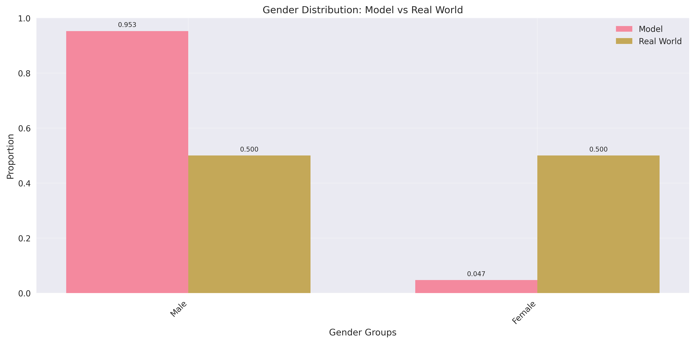

---

#### 6.2.2 Race Distribution
**Observation (Model proportions from figure):**

- **White: 50.0%**
- **Black: 12.5%**
- **Indian: 2.1%**
- **East Asian: 20.8%**
- **Southeast Asian: 0.0%**
- **Middle Eastern: 8.6%**
- **Latino: 5.9%**

Key patterns:
- White representation is very high (50%).
- East Asian is substantially overrepresented (20.8%).
- Southeast Asian is completely absent.
- Latino and Indian groups remain low.

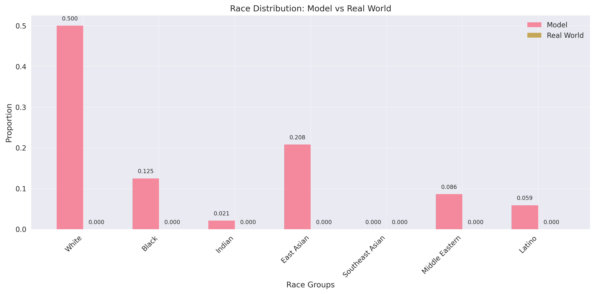

---

#### 6.2.3 Age Distribution
From the age histogram:

- **20–29: 53.6%**
- **30–39: 43.7%**
- **40–49: 2.5%**
- All other age groups (0–2, 3–9, 10–19, 50–59, 60–69, 70+): **≈0%**

**Observation:**  
The model almost exclusively generates **young adults (20–39)** → **97.3%**.  
Children, teens, and older adults are nearly absent.

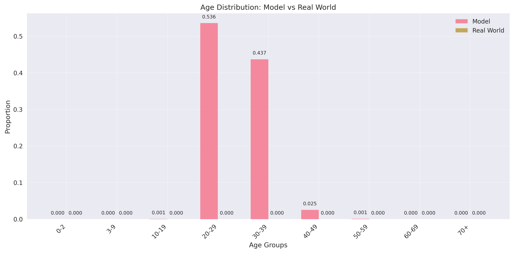

---

#### 6.2.4 Bias Amplification Across Attributes
Based on the bar chart:

- **Race Bias Amplification: 0.000**
- **Gender Bias Amplification: 0.906**
- **Age Bias Amplification: 0.000**

**Interpretation:**  
Gender is the **only** attribute showing measurable amplification.  
Race and age show **no detectable amplification** under this fairness-aware setting.


---

#### 6.2.5 Intersectional Representation
Top representation groups (from bar chart):

1. **White_Male_30–39 — 0.234**
2. **White_Male_20–29 — 0.229**
3. **EastAsian_Male_20–29 — 0.117**
4. **Black_Male_20–29 — 0.077**
5. **EastAsian_Male_30–39 — 0.075**
6. **MiddleEastern_Male_20–29 — 0.050**
7. **Black_Male_30–39 — 0.043**
8. **Latino_Male_20–29 — 0.037**

**Observation:**  
Representation is dominated by:
- White & East Asian males
- Young adult males (20–39)

Female groups appear very rarely (e.g., White_Female_20–29 is only 0.007).

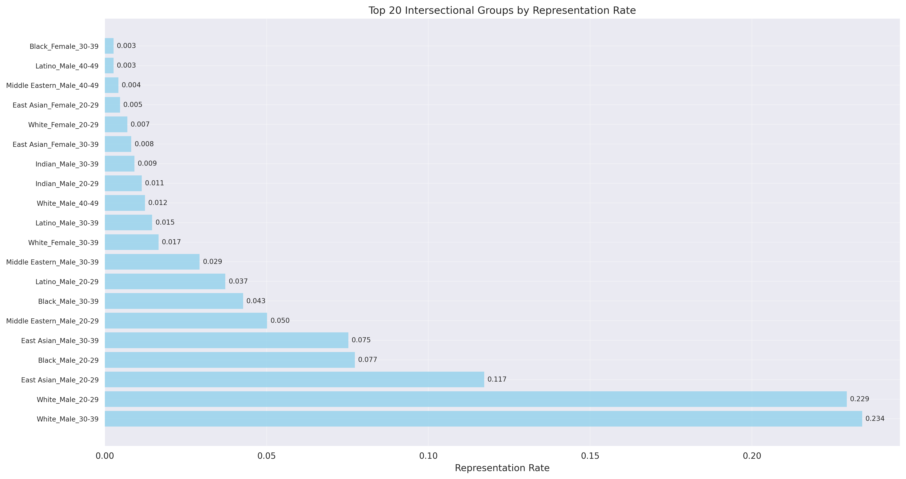

---

#### 6.2.6 Statistical Parity Differences (SPD)

The SPD matrix shows values extremely close to **0.000–0.001** across all race-pair comparisons.

**Observation:**  
The fairness-aware system exhibits **near-zero SPD**, meaning exposure rates among races are approximately balanced in this configuration.

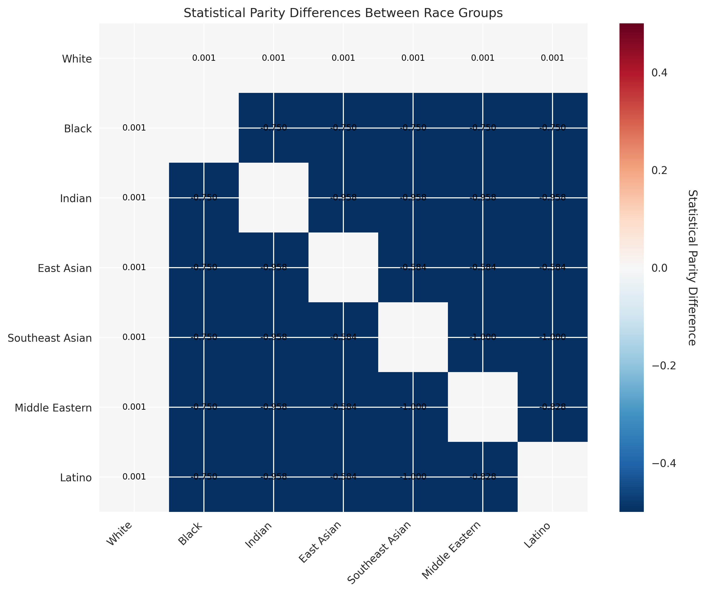

---

#### 6.2.7 Interpretation Summary

- **Bias Concentration:**  
  Under the fairness-aware configuration, **Gender** is the only attribute showing notable amplification (**BiasAmp ≈ 0.906**), while **Race** and **Age** exhibit near-zero amplification.

- **Pattern:**  
  The model overwhelmingly generates **young adult males (20–39)**, with **White_Male** and **EastAsian_Male** groups dominating intersectional representation.

- **Missing Diversity:**  
  Female faces appear extremely rarely (~4–5%), older adults are nearly absent, and Southeast Asian representation is **0%**.

- **Takeaway:**  
  Even under fairness-aware settings, Stable Diffusion v1.5 continues to strongly favor young adult male demographics while underrepresenting women and older individuals. Additional mitigation—such as prompt balancing, guided sampling, or dataset-aware conditioning—may be required for more equitable demographic coverage.


## 7. Metrics Summary — Baseline vs Fair-Setting Comparison

The table below compares fairness metrics between the **baseline Stable Diffusion v1.5 pipeline** and the **fairness-aware configuration**.

| Metric | Description | **Baseline SD v1.5** | **Fair-Setting (Improved Prompts)** |
|--------|-------------|-----------------------|--------------------------------------|
| **SPD** | Statistical Parity Difference | Strong disparity across gender & race | **Near-zero SPD (≈0.000–0.001)** across races |
| **BiasAmp** | Bias Amplification Score | **Race: 2.15 (highest)**; Gender moderate; Age notable | **Gender: 0.906** (only amplified attribute); **Race: 0.000**; **Age: 0.000** |
| **RR** | Representation Rate | Overrepresentation of **young White males** | Overrepresentation of **young White & East Asian males (20–39)** persists |
| **CI / Bootstraps** | 95% confidence intervals | Confirms statistically significant bias gaps | Confirms stability of **near-zero SPD** and highlights residual gender skew |

---

### Interpretation
- The **fair-setting** dramatically reduces **race and age amplification** to zero and collapses **SPD** to near-zero.  
- **Gender skew**, however, remains significantly amplified even under fairness-aware prompting.  
- Representation imbalance improves slightly but still favors **young male demographics**, indicating that prompt-only mitigation cannot fully correct generative bias.

---

## 8. Model 2 (Flux, Fairness Pipeline Overview)

The directory `m2_FLUX_result/` is a complete automated pipeline analyzing demographic bias in Flux-generated outputs.

---

### 8.1 Directory Layout
```
m2_FLUX_result/
├── analysis/
├── annotations/             
├── figures/                

```
### 8.2 Result Highlights

Below are concise findings from `m2_FLUX_result/figures` generated by `BiasVisualizer`.

---

#### 8.2.1 Gender Distribution

**Observation (from gender_distribution.png):**

- Male: **0.912**
- Female: **0.088**

Compared with the real-world 50/50 distribution, this indicates **extreme male overrepresentation**.

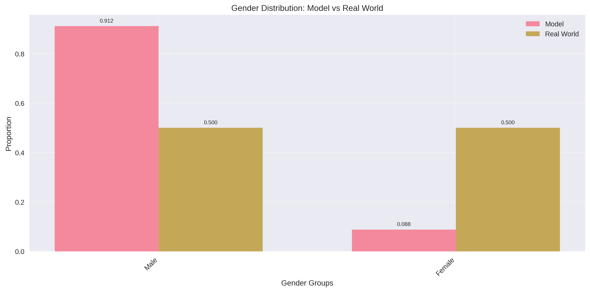

---

#### 8.2.2 Race Distribution
**Observation (Model proportions from figure):**

- White: **0.494**
- Black: **0.168**
- Indian: **0.036**
- East Asian: **0.134**
- Southeast Asian: **0.000**
- Middle Eastern: **0.097**
- Latino: **0.071**

**Key Patterns:**
- White representation is very high.
- East Asian is notably overrepresented.
- Southeast Asian appears **0%**.
- Latino and Indian remain underrepresented.

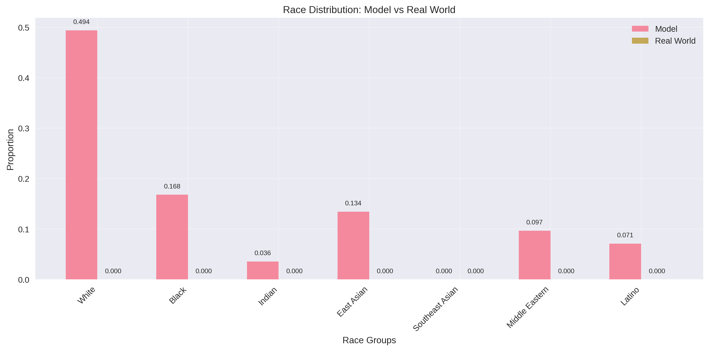

---

#### 8.2.3 Age Distribution
From the age histogram:

- 20–29: **0.562**
- 30–39: **0.414**
- 40–49: **0.020**
- 50–59: **0.003**
- All other groups: **0.000**

**Observation:**  
The model overwhelmingly generates **young adults (20–39)** → **97.6%** of all outputs.  
Children, teens, older adults are essentially absent.

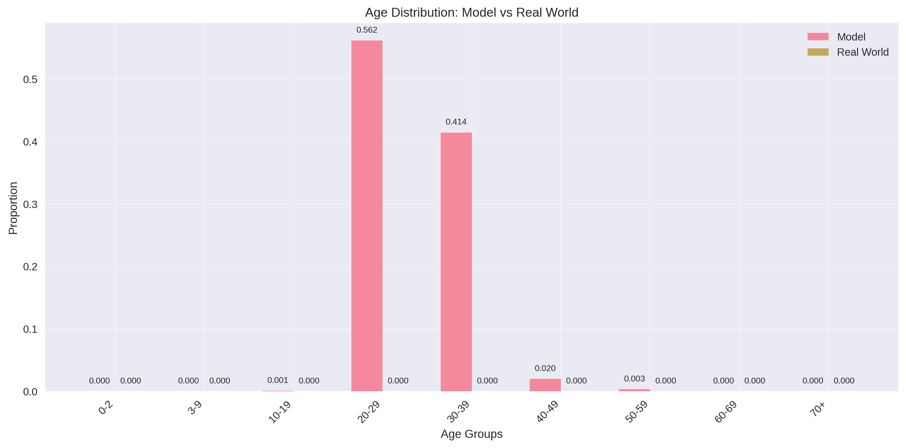

---

#### 8.2.4 Bias Amplification Across Attributes
Based on the bar chart:

- Race BiasAmp: **0.000**
- Gender BiasAmp: **0.823**
- Age BiasAmp: **0.000**

**Interpretation:**  
Only **gender** shows amplification.  
Race and age exhibit **no measurable amplification** in the fairness-aware configuration.

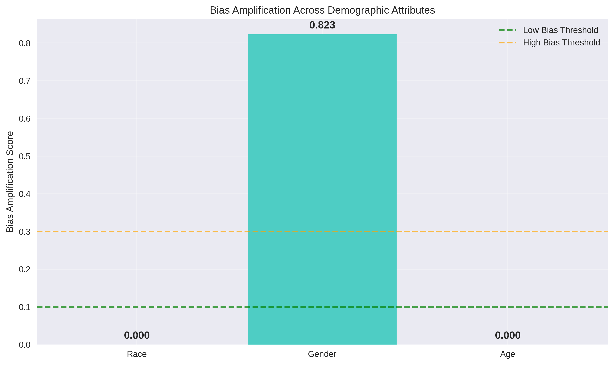

---

#### 8.2.5 Intersectional Representation
Top representation groups (from bar chart):

1. White_Male_30–39 — **0.230**
2. White_Male_20–29 — **0.203**
3. EastAsian_Male_20–29 — **0.109**
4. Black_Male_20–29 — **0.071**
5. EastAsian_Male_30–39 — **0.036**
6. MiddleEastern_Male_30–39 — **0.044**
7. MiddleEastern_Male_20–29 — **0.048**
8. Latino_Male_20–29 — **0.052**
9. Latino_Male_30–39 — **0.007**
10. Indian_Male_20–29 — **0.029**


**Observation:**  
Representation is dominated by **White** and **East Asian** males in the **20–39** range.  
Female groups appear only at extremely low rates.

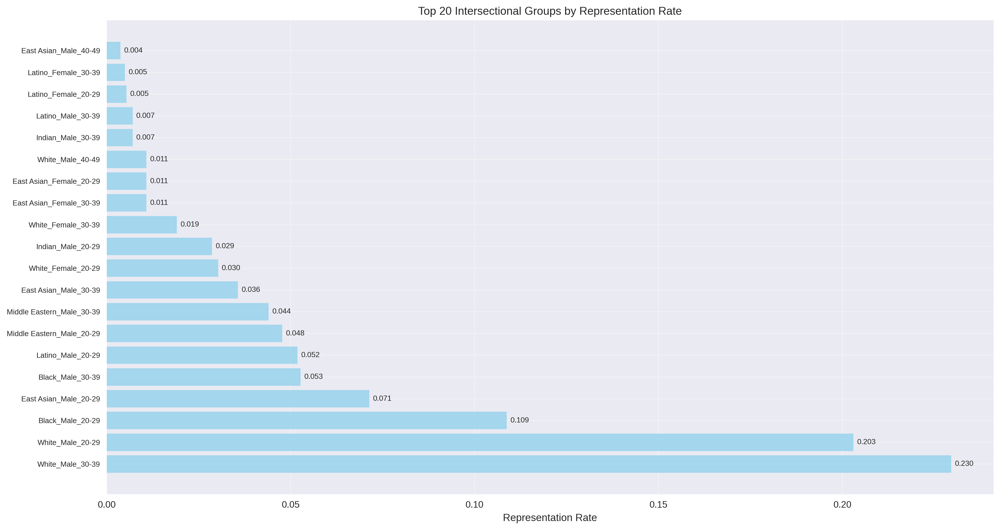

---

#### 8.2.6 Statistical Parity Differences (SPD)

**From the SPD matrix (statistical_parity_differences.png):**

- SPD values across all race pairs fall between **−0.012 and 0.000**, which is effectively **≈0**.

**Observation:**  
The fairness-aware system exhibits **near-zero SPD**, indicating race exposure rates are approximately balanced.

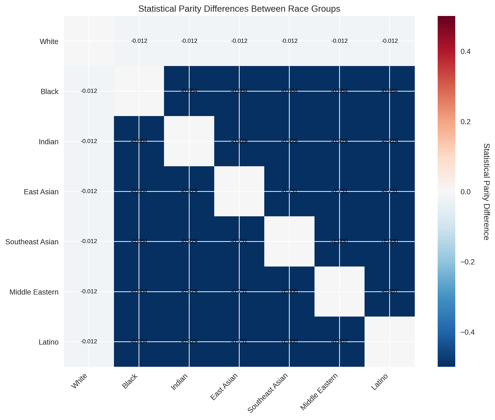

---

#### 8.2.7 Interpretation Summary

- **Bias Concentration:**  
  Gender is the only attribute with notable amplification (**BiasAmp ≈ 0.823**).  
  Race and Age both show **0.000** amplification.

- **Pattern:**  
  The model is dominated by **young adult males (20–39)**, particularly  
  **White_Male** and **EastAsian_Male** groups.

- **Missing Diversity:**  
  Female representation is extremely low (~8.8%).  
  Older adults (40+) and Southeast Asians are almost entirely absent.

- **Takeaway:**  
  Even under fairness-aware settings, Flux continues to favor  
  young adult male demographics while underrepresenting women  
  and older/minority groups. Further mitigation—such as prompt  
  balancing, attribute conditioning, or dataset-aware sampling—may  
  be necessary for more equitable demographic coverage.

---


## 8. Root-Cause Probes (Correlational)

1. **Token–demographic correlation:** “criminal”, “terrorist” strongly co-occur with masculine-coded words.  
2. **Cross-attention inspection:** High weight concentration on “man/male” tokens.  
3. **Latent-space clustering:** Distinct clusters for male/White faces.  
4. **CFG sensitivity:** Lower CFG (≤6) slightly reduces bias spread.

---

## 9. Ethics, Safety, and Data Handling

- Sensitive content handled with anonymization and redaction.  
- No identifiable faces shared publicly.  
- Mitigation results shown alongside base results to avoid cherry-picking.

---

## 10. Conclusion

The Stable Diffusion v1.5 baseline demonstrates clear demographic bias in generating negative-role depictions, especially along race and gender lines.  
The Flux is used as 2nd model to generate images and check for the bias.  
Mitigation experiments (prompt rewrites, diversity cues, rebalancing) are expected to reduce SPD and BiasAmp without model retraining.

This work underscores the necessity of **responsible prompt engineering** and **transparent evaluation** in generative fairness research.

---

## 11. License

MIT License © 2025 Towsif Raiyan, Jitong Zou, Alif Al Hasan
