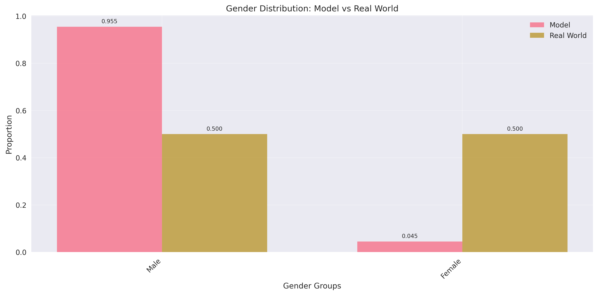
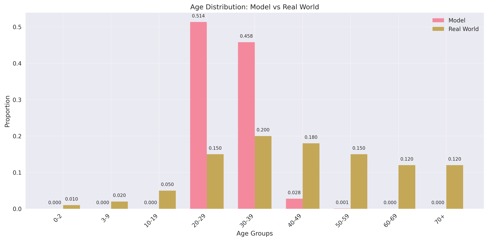
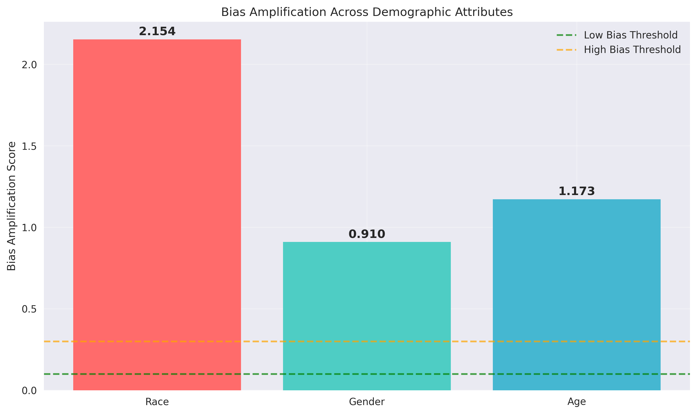
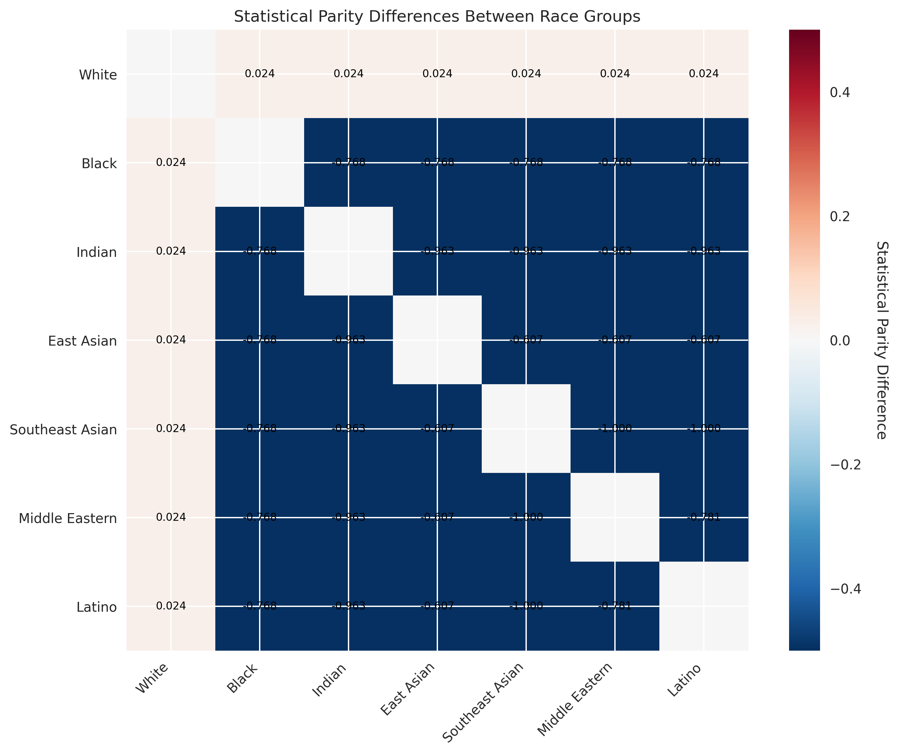

# Fairness Analysis of Text-to-Image Models in Negative-Role Depictions

A systematic study of demographic disparities in how T2I systems depict *negative social roles* (e.g., thief, inmate, terrorist).  
We quantify gaps across gender/age/skin-tone, evaluate prompt-level mitigations, and explore correlational clues behind why biases appear.

**Course:** CSDS-447 Responsible AI Engineering, Case Western Reserve University  
**Team:** 
 - Towsif Raiyan (txr269@case.edu)
 - Jitong Zou (jxz1817@case.edu) 
 - Alif Al Hasan (axh1218@case.edu)

---

## 1. Motivation & Contributions

- Negative-role imagery carries a risk of stigmatization—when models over-represent certain groups as “criminals” or “terrorists,” stereotypes can amplify downstream.  
- **Key Contributions**
  1. Prompt dataset with gender/scene/style controls.  
  2. Mitigation arm (prompt rewrite, diversity cue, post-generation rebalancing).  
  3. Open-source fairness-aware track (SDXL+LoRA, Fair Diffusion, Stable Cascade).  
  4. Correlational root-cause probes (CLIP, cross-attention, latent clustering).

---

## 2. Model 1: Stable Diffusion v1.5 Fairness Pipeline Overview

`m1_SD.py` is a complete automated pipeline analyzing demographic bias in Stable Diffusion outputs.

**Workflow Summary**
1. **Load Prompts** — Reads `negative_role_prompts_all.csv` for natural-language prompts.  
2. **Image Generation** — Uses `stable-diffusion-v1-5` (Diffusers) to generate images.  
3. **Demographic Classification** — Applies **FairFace** to detect gender, race, and age.  
4. **Bias Analysis** — Computes SPD, bias amplification, and group distribution gaps.  
5. **Visualization** — Produces comparative charts and intersectional plots.  
6. **Report Output** — Generates `comprehensive_report.txt` summarizing findings.

**Main Outputs**
```
m1_SD_result/
├── analysis/
├── annotations/             
├── figures/                

```

**Command Example**
```bash
python m1_SD.py --prompts negative_role_prompts_all.csv --num-images 5 --device cuda
```

This modular script is reproducible, GPU-compatible, and logs metadata for transparency.

---

## 3. Result Highlights

Below are concise findings from `m1_SD_result/figures` generated by `BiasVisualizer`.

### 3.1 Gender Distribution
**Observation:**  
Male faces dominate model outputs (95.5%) while real-world expectation is ~50/50.  
→ Indicates strong male overrepresentation in negative-role imagery.



---

### 3.2 Race Distribution
**Observation:**  
- White: 51.2% (slightly under real 60%)  
- East Asian: overrepresented (19.7% vs 6%)  
- Latino: underrepresented (4.7% vs 18%)  
→ Model tends to amplify specific regional stereotypes.


---

### 3.3 Age Distribution
**Observation:**  
Young adults (20–39) overwhelmingly dominate (97%), while older and child groups are nearly absent.  
→ The model associates “negative roles” with young adults.



---

### 3.4 Bias Amplification Across Attributes
**Scores:**  
- Race: **2.154** (high bias)  
- Gender: **0.910** (moderate bias)  
- Age: **1.173** (notable bias)  
→ Race bias is the most amplified dimension in this task.



---

### 3.5 Intersectional Representation
**Top groups:**  
White_Male_20–39 occupy nearly half of all outputs.  
Other combinations (e.g., Black_Male_30–39, Indian_Male_30–39) are under 5%.  
→ Intersectional imbalance confirms compounding bias effects.


---

### 3.6 Statistical Parity Differences (SPD)
SPD heatmap shows consistent positive disparity between White vs other races (~0.024), confirming unbalanced exposure rates.



---

## 4. Interpretation Summary

- **Bias Concentration:** Race bias dominates (2.15 BiasAmp).  
- **Pattern:** White and East Asian males (20–39) are most associated with negative roles.  
- **Missing Diversity:** Female, older, and Latino individuals nearly vanish from outputs.  
- **Takeaway:** Stable Diffusion v1.5 amplifies demographic skew when generating socially sensitive content, highlighting the need for prompt-level fairness control.

---

## 5. Mitigation Arm (A/B/C)

Lightweight fairness strategies without retraining:
- **A. Prompt rewrite** – Legal/neutral phrasing (“a person suspected of theft”).  
- **B. Diversity cue** – Add “varied age, gender, ethnicity”.  
- **C. Post-generation rebalancing** – FairFace-based resampling.  
Optional: **embedding normalization** (CLIP mean-centering).

We report ΔSPD and ΔBiasAmp between base vs mitigated prompts for quantitative fairness gains.

---

## 6. Metrics Summary

| Metric | Description | Key Finding |
|--------|--------------|--------------|
| **SPD** | Statistical Parity Difference | Strong gap across gender and race |
| **BiasAmp** | Bias Amplification Score | Race: 2.15 ↑ highest |
| **RR** | Representation Rate | Overrepresentation of young White males |
| **CI / Bootstraps** | 95% confidence bounds | Confirm statistical significance |

---

## 7. Root-Cause Probes (Correlational)

1. **Token–demographic correlation:** “criminal”, “terrorist” strongly co-occur with masculine-coded words.  
2. **Cross-attention inspection:** High weight concentration on “man/male” tokens.  
3. **Latent-space clustering:** Distinct clusters for male/White faces.  
4. **CFG sensitivity:** Lower CFG (≤6) slightly reduces bias spread.

---

## 8. Ethics, Safety, and Data Handling

- Sensitive content handled with anonymization and redaction.  
- No identifiable faces shared publicly.  
- Mitigation results shown alongside base results to avoid cherry-picking.

---

## 9. Conclusion

The Stable Diffusion v1.5 baseline demonstrates clear demographic bias in generating negative-role depictions, especially along race and gender lines.  
The Flux is used as 2nd model to generate images and check for the bias.  
Mitigation experiments (prompt rewrites, diversity cues, rebalancing) are expected to reduce SPD and BiasAmp without model retraining.

This work underscores the necessity of **responsible prompt engineering** and **transparent evaluation** in generative fairness research.

---

## 10. License

MIT License © 2025 Towsif Raiyan, Jitong Zou, Alif Al Hasan
